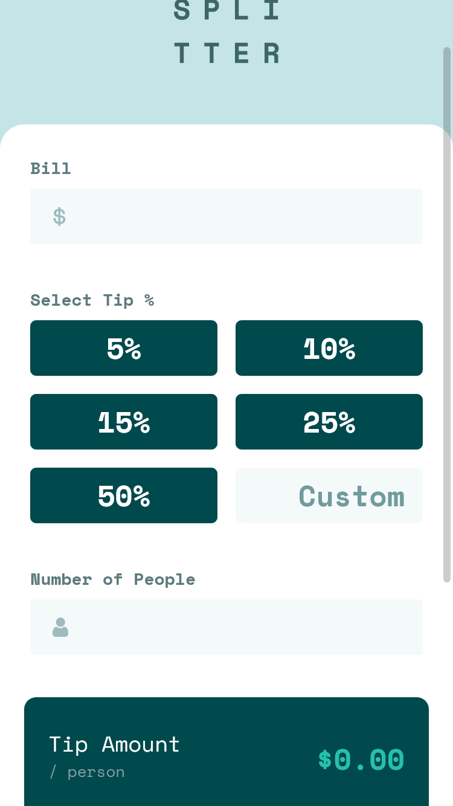
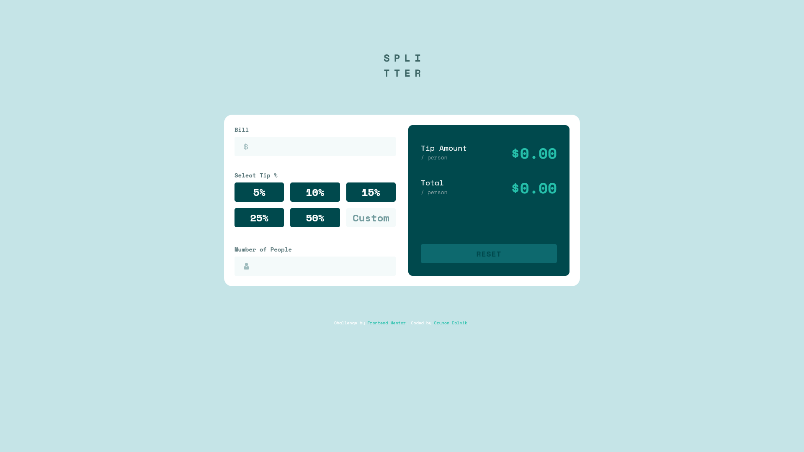

# Frontend Mentor - Tip calculator app solution

This is a solution to the [Tip calculator app challenge on Frontend Mentor](https://www.frontendmentor.io/challenges/tip-calculator-app-ugJNGbJUX). Frontend Mentor challenges help you improve your coding skills by building realistic projects.

## Table of contents

- [Overview](#overview)
  - [The challenge](#the-challenge)
  - [Links](#links)
  - [Screenshot](#screenshot)
- [My process](#my-process)
  - [Built with](#built-with)
  - [What I learned](#what-i-learned)
  - [Continued development](#continued-development)
  - [Useful resources](#useful-resources)
- [Author](#author)

## Overview

### The challenge

Users should be able to:

- View the optimal layout for the app depending on their device's screen size
- See hover states for all interactive elements on the page
- Calculate the correct tip and total cost of the bill per person

### Links

- Solution URL: [Add solution URL here](https://github.com/Haxikowy/fem-tip-calculator)
- Live Site URL: [Add live site URL here](https://haxikowy.github.io/fem-tip-calculator)

### Screenshot




## My process

### Built with

- Semantic HTML5 markup
- CSS custom properties
- CSS Grid
- Mobile-first workflow
- JavaScript ES6+

### What I learned

Basically I grinded my HTML & CSS & JS skills. In CSS most trouble causing for me was grid - learned it a lot. Next thing in CSS that I learned is selectors, I thought I understand it, but the truth was slightly different. In JS I had a lot of trouble about form validation I learned that if I use

```js
someFormElement.reset();
```

and I have event listener, listening for 'change' it doesn't actually cause any change event so I need to do it 'manually'. I started adding a lot of comments in my JS - it improves readability a lot! I know that JavaScript side of this project is weakest, I will improve and change this project in future.

### Continued development

In future I will definetly focus on JavaScript side form validation - I haven't learned a lot about it --- need to make it up. I still need to learn about JavaScripts' paradigms - I like a lot the functional paradigm.

### Useful resources

- [MDN](https://developer.mozilla.org/en-US/) - Syntax, syntax, syntax!
- [CSS tricks](https://css-tricks.com/snippets/css/complete-guide-grid/) - CSS tricks are just awesome, if You dont understand on MDN here u will definetly understand it!
- [StackOverflow](https://stackoverflow.com/) - If you don't understand something about your code here You will have answers.

## Author

- Website - [Szymon Dolnik](https://github.com/Haxikowy/)
- Frontend Mentor - [@Haxikowy](https://www.frontendmentor.io/profile/Haxikowy)
